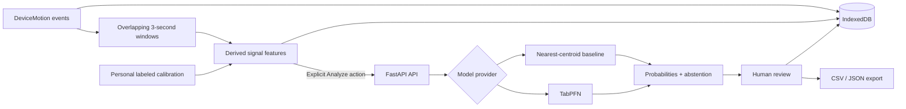

# GroundSignal

> **The sidewalk told on itself.** Turn a short outdoor walk into a private, inspectable, uncertainty-aware surface report.

[](https://github.com/abhijeetnardele24-hash/groundsignal/actions/workflows/ci.yml)


GroundSignal is a local-first pocket field instrument for the Hacktoberfest 2026 Week 1 **Touch Grass** challenge. It uses phone motion sensors, personal calibration, transparent signal features, and an open tabular model to describe how a path felt underfoot or under wheels—without collecting location or identity.

The project is built for two challenge categories:

- **Best Use of TabPFN:** few-shot, personal surface classification from a small labeled calibration set.
- **Best Use of Render:** a deployable PWA and bounded FastAPI inference service defined in one Blueprint.

> GroundSignal is a field-observation aid. It is not a safety guarantee, navigation service, or universal accessibility rating.

## Why this should exist

Traditional path data is usually static, generic, or tied to a map. But a surface feels different depending on a person's mobility mode, phone hardware, placement, weather, and pace. GroundSignal treats that variability as a first-class product constraint:

1. **Calibrate personally.** Record a few known surfaces with the same device and placement.
2. **Go outside.** Start an audit, put the phone in a pocket or mount, and move normally.
3. **Keep attention off the screen.** Pocket Mode becomes a deliberately minimal recording surface.
4. **Analyze transparently.** Overlapping windows become interpretable features; raw motion never goes to the API.
5. **Expose uncertainty.** Low-confidence windows are abstained and queued for human review.
6. **Create evidence.** Confirm, correct, or discard predictions, then export a documented CSV or JSON report.

## Product highlights

| Capability | What it contributes |
| --- | --- |
| Real motion capture | Requests `DeviceMotionEvent` permission only after an explicit user action and records acceleration plus rotation. |
| Personal calibration | Learns from the user's mobility mode, device, placement, and known surfaces instead of claiming a universal threshold. |
| Pocket Mode | A low-distraction recording UI designed to disappear into a pocket during the walk. |
| Open model path | Supports TabPFN for competition inference and a deterministic nearest-centroid baseline for offline/demo resilience. |
| Honest uncertainty | Returns class probabilities, confidence, and an explicit abstention state below the documented threshold. |
| Human correction loop | Lets users confirm, relabel, or discard windows and deliberately promote reviewed evidence into later calibration. |
| Local-first ledger | Keeps raw sessions and reports in IndexedDB, caps retention, and lets users reopen recent work. |
| Portable evidence | Exports CSV and JSON containing provenance, features, model output, final labels, and review status. |
| Judge-safe demo | Provides a clearly marked synthetic walk so the full experience can be evaluated without a phone sensor. |
| Installable PWA | Includes a manifest and service worker for an app-like, offline-ready field experience. |

## Architecture and privacy boundary



| Data | Default location | Sent to API? |
| --- | --- | --- |
| Raw acceleration and rotation | Browser IndexedDB | **No** |
| Precise location | Not collected | **No** |
| Identity or account data | Not collected | **No** |
| Derived window features | IndexedDB and request memory | Only when analysis is requested |
| User-provided calibration labels | IndexedDB and request memory | Only when analysis is requested |
| Predictions and corrections | IndexedDB | Predictions are returned by the API; corrections remain local |

The API forbids unknown schema fields, limits request size and concurrency, rate-limits clients, enforces an inference timeout, restricts CORS, and returns defensive security headers. The full boundary is documented in [`docs/architecture.md`](docs/architecture.md).

## Repository map

```text
groundsignal/
├── frontend/                 React 19 + TypeScript + Vite PWA
│   ├── src/lib/              sensor, feature, API, and storage modules
│   └── public/               installable app assets
├── backend/                  FastAPI analysis service
│   ├── app/                  schemas, security, model providers, evaluation
│   ├── scripts/              report evaluation CLI
│   └── tests/                API, schema, model, and metric tests
├── docs/                     architecture, field protocol, demo, research
├── .github/workflows/ci.yml  frontend/backend verification
└── render.yaml               frontend + API deployment Blueprint
```

## Quick start

### Prerequisites

- Node.js 22 or newer
- Python 3.11 or newer
- A modern Chromium- or Safari-based mobile browser for physical motion capture

### 1. Start the API

```powershell
cd backend
python -m venv .venv
.\.venv\Scripts\Activate.ps1
python -m pip install -e ".[test]"
Copy-Item .env.example .env
uvicorn app.main:app --reload
```

The local baseline works without an external token. The API starts at `http://localhost:8000`; interactive documentation is available at `/docs` outside production.

### 2. Start the PWA

In a second terminal:

```powershell
cd frontend
npm ci
Copy-Item .env.example .env
npm run dev
```

Open the URL printed by Vite. The desktop **transparent demo walk** is synthetic and labeled as such in both the UI and exports. Real motion capture normally requires HTTPS on a physical phone; `localhost` is treated as a secure development context.

## Configuration

### Frontend

| Variable | Default | Purpose |
| --- | --- | --- |
| `VITE_API_URL` | `http://localhost:8000` | Analysis API origin. |

### Backend

| Variable | Default | Purpose |
| --- | --- | --- |
| `ENVIRONMENT` | `development` | Disables interactive API docs when set to `production`. |
| `MODEL_PROVIDER` | `baseline` | `baseline` or `tabpfn`. |
| `ALLOWED_ORIGINS` | local Vite origins | Comma-separated browser origins allowed by CORS. |
| `MAX_BODY_BYTES` | `1500000` | Maximum request-body size. |
| `RATE_LIMIT_REQUESTS` | `20` | Requests permitted in each rate-limit window. |
| `RATE_LIMIT_WINDOW_SECONDS` | `60` | Rate-limit window length. |
| `ANALYSIS_TIMEOUT_SECONDS` | `45` | Maximum model execution time. |
| `MAX_CONCURRENT_ANALYSES` | `2` | Process-level inference concurrency bound. |
| `TABPFN_TOKEN` | unset | Secret required only for the TabPFN provider. |

Never commit `.env` files or tokens. Example files are intentionally safe to commit.

## Use TabPFN

```powershell
cd backend
python -m pip install -e ".[tabpfn,test]"
$env:MODEL_PROVIDER = "tabpfn"
$env:TABPFN_TOKEN = "your-token"
uvicorn app.main:app --reload
```

TabPFN is a strong fit for GroundSignal because each field session starts with a small, user-specific tabular calibration set. The provider receives bounded derived features—not raw telemetry—and returns a probability distribution for `smooth`, `rough`, `unstable`, and `transition`.

## API contract

| Method | Endpoint | Purpose |
| --- | --- | --- |
| `GET` | `/health` | Reports service health and active provider. |
| `GET` | `/v1/model-card` | Exposes labels, input boundary, limitations, and abstention threshold. |
| `POST` | `/v1/analyze` | Classifies audit windows from personal calibration features. |

Analysis requires at least eight calibration rows spanning two surface classes. Every prediction contains full class probabilities, confidence, and an `abstained` flag. Unknown fields, non-finite values, out-of-range features, and oversized collections are rejected.

## Evaluation, not just a demo

After a real audit, review uncertain windows in the UI and export JSON. Then score only the human-reviewed audit windows:

```powershell
cd backend
python -m scripts.evaluate_report path\to\groundsignal-report.json --provider baseline
```

To compare both model paths:

```powershell
$env:TABPFN_TOKEN = "your-token"
python -m scripts.evaluate_report path\to\groundsignal-report.json --provider both
```

The evaluator reports macro F1, balanced accuracy, expected calibration error, abstention rate, latency, and a confusion matrix. Calibration windows are kept out of the scored audit set to avoid an artificially flattering result.

## Verification

```powershell
# Frontend
cd frontend
npm test
npm run build
npm audit --omit=dev --registry=https://registry.npmjs.org/

# Backend
cd ..\backend
python -m pytest -q
python -m pip check
```

Current local verification: **3 frontend tests passed, production PWA build passed, npm reported 0 vulnerabilities, 10 backend tests passed, and Python reported no broken requirements.** GitHub Actions repeats tests, the frontend build, and the production dependency audit on every push and pull request.

## Deploy on Render

1. Create a new Render Blueprint from this repository using [`render.yaml`](render.yaml).
2. Set the API service's secret `TABPFN_TOKEN`.
3. Set the API service's `ALLOWED_ORIGINS` to the final HTTPS frontend origin.
4. Set the frontend service's `VITE_API_URL` to the final HTTPS API origin.
5. Deploy both services, then confirm `/health`, a real analysis, PWA installation, offline reload, and sensor permission on a phone.

The Blueprint applies `nosniff`, no-referrer, and restrictive browser permission headers. It deliberately disables geolocation, camera, and microphone because GroundSignal does not need them.

## Three-minute judge path

1. Open with the local ledger and the privacy boundary.
2. Select mobility mode and phone placement; record two known surface types.
3. Start an audit and show the intentionally quiet Pocket Mode.
4. Stop and explain the feature pipeline, provider label, probabilities, and abstentions.
5. Correct one uncertain segment, discard another, and explicitly promote reviewed evidence.
6. Export both formats and close on the limitation: evidence, not a safety guarantee.

The complete talk track is in [`docs/demo-script.md`](docs/demo-script.md).

## Documentation

- [`docs/product-brief.md`](docs/product-brief.md) — product thesis and differentiation
- [`docs/architecture.md`](docs/architecture.md) — data flow, privacy boundary, and model behavior
- [`docs/field-test-protocol.md`](docs/field-test-protocol.md) — reproducible outdoor evidence collection
- [`docs/research-notes.md`](docs/research-notes.md) — product and technical research
- [`docs/demo-script.md`](docs/demo-script.md) — concise judge narrative
- [`docs/submission-checklist.md`](docs/submission-checklist.md) — remaining competition evidence and publishing work
- [`CONTRIBUTING.md`](CONTRIBUTING.md), [`SECURITY.md`](SECURITY.md), and [`CODE_OF_CONDUCT.md`](CODE_OF_CONDUCT.md) — project governance

## Known limitations

- Device sensors and browser permission behavior vary; physical phone testing is mandatory before making claims.
- Classifications are session-specific and should not be generalized across people, devices, placements, or weather.
- Browser storage can be evicted; important evidence should be exported.
- The offline baseline is a resilient fallback, not a substitute for the planned TabPFN field comparison.
- No location is collected, so GroundSignal describes a session rather than publishing a route map.

## Challenge readiness

The code-side MVP is complete and reproducible. A strong final entry still requires work outside this repository: a real HTTPS phone field test, non-sensitive evidence, baseline-versus-TabPFN results, a deployed public demo, screenshots/video, and the final DEV post. Track these honestly in [`docs/submission-checklist.md`](docs/submission-checklist.md).

The repository is initially private by request. The challenge submission requires accessible source code, so its visibility must be changed to public before the final entry is submitted.

## Contributing and security

Contributions are welcome through focused issues and pull requests; see [`CONTRIBUTING.md`](CONTRIBUTING.md). Please report vulnerabilities using the private process in [`SECURITY.md`](SECURITY.md), not a public issue.

GroundSignal is released under the [MIT License](LICENSE).
