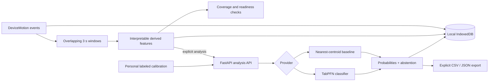

# GroundSignal architecture

GroundSignal is deliberately split at a privacy boundary: raw motion belongs to
the browser; model-ready features may cross the network only when analysis is
requested.

## Data boundary

| Data | Default location | Sent to API? |
| --- | --- | --- |
| Raw acceleration and rotation | IndexedDB on the current device | No |
| Precise location | Not collected | No |
| Derived window features | IndexedDB and in-memory request | Yes, on analysis |
| Calibration labels | IndexedDB and in-memory request | Yes, on analysis |
| Predictions and confidence | IndexedDB | Returned by API |
| Readiness and evidence quality | Derived locally from window metadata | No |

The API schema rejects unknown fields, so a client cannot accidentally attach
coordinates or raw telemetry to the analysis payload. The frontend falls back
to an explicitly named offline baseline if the hosted model cannot be reached.

Before analysis, the client requires usable calibration windows from at least
two known surface classes. It records average sample coverage, short windows,
and low-coverage windows with every report. These checks describe evidence
quality; they never certify that a path is safe or accessible.

## Model behavior

Each prediction includes a full class probability distribution. Confidence below
`0.58` is marked `abstained`, making a review state visible rather than converting
uncertainty into a categorical claim. The output describes a sensor observation;
it is not a route-safety guarantee or a universal accessibility assessment.
